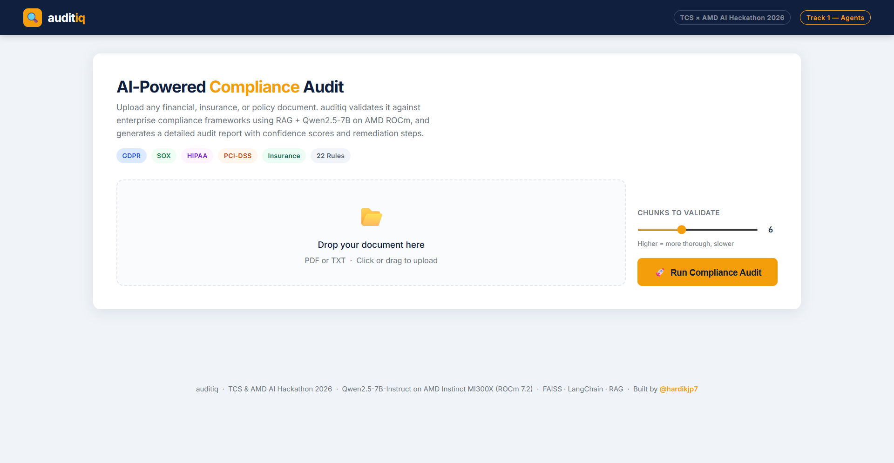
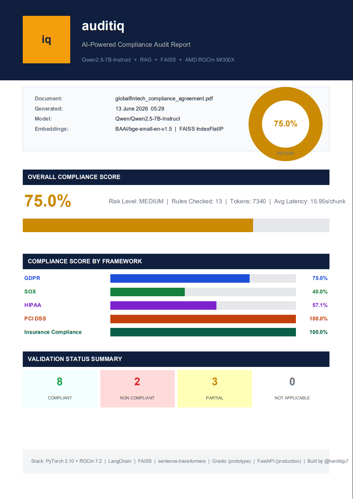
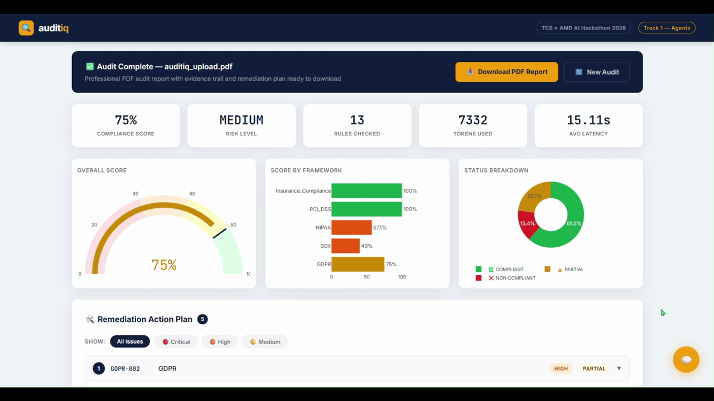
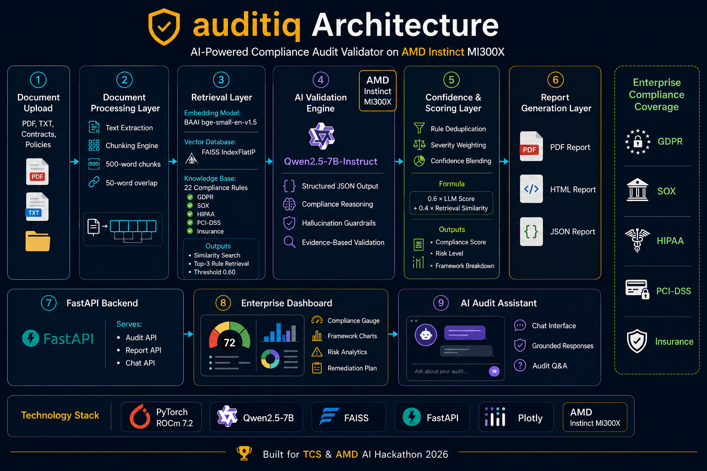
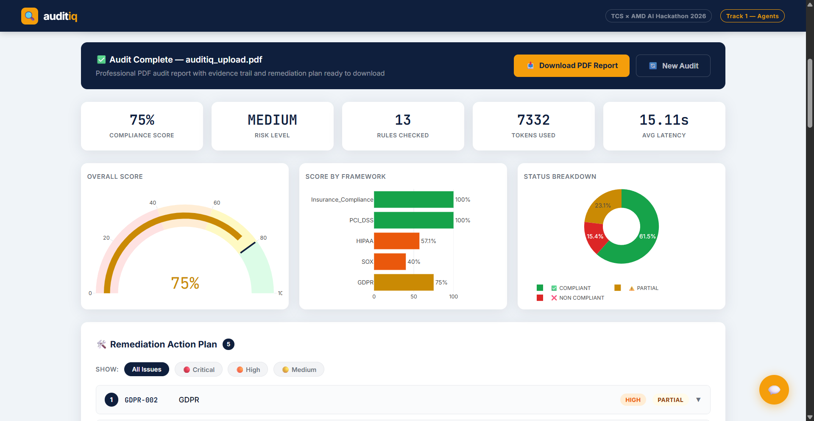

<div align="center">


# auditiq - AI-Powered Compliance Audit Validator

**Upload any enterprise document. Get a professional compliance audit in seconds.**

[](https://python.org)
[](https://pytorch.org)
[](https://amd.com)
[](https://fastapi.tiangolo.com)
[](https://huggingface.co/Qwen)
[](https://faiss.ai)
[](LICENSE)

<br>



<br>

---

🏆 **Built for TCS & AMD AI Hackathon 2026** - *"Innovate. Build. Accelerate with AI"*

*Track 1 - Agents · Use Case AGENTS_006 · Solo Participant*

[**Features**](#features) · [**Architecture**](#architecture) · [**Demo Results**](#demo-results) · [**Setup**](#setup) · [**Usage**](#usage) · [**Scoring**](#scoring-methodology) · [**Roadmap**](#roadmap)

</div>

---

## 🏆 Hackathon Context

This project was built entirely during the **TCS & AMD AI Hackathon 2026**, an innovation-driven challenge empowering TCS engineers to build enterprise-ready AI solutions using AMD-powered accelerated computing.

| | |
|---|---|
| **Event** | TCS & AMD AI Hackathon 2026 |
| **Theme** | Innovate. Build. Accelerate with AI |
| **Track** | Track 1 - Agents |
| **Use Case** | AGENTS_006 - AI-Driven Audit & Compliance Validator |
| **GPU** | AMD Instinct MI300X · 206 GB HBM3 · ROCm 7.2 |
| **Platform** | AMD Jupyter Cloud · `notebooks.amd.com/tcs-hackathon` |
| **GPU Credits** | $100 AMD Developer Cloud credits via AMD AI Developer Program |
| **Build Period** | June 8 – 17, 2026 |
| **Participant** | Solo - Hardik Parmar · [@hardikjp7](https://github.com/hardikjp7) |

> **No NVIDIA hardware was used at any point.** All development, inference, and testing ran exclusively on AMD Instinct MI300X via AMD ROCm 7.2.

---

## 🎯 What is auditiq?

**auditiq** is an AI-powered compliance audit validator that automatically validates financial, insurance, and policy documents against enterprise regulatory frameworks.

```
Upload PDF / TXT  →  RAG retrieval  →  LLM validation  →  PDF audit report  →  Chat Q&A
```

**Who is it for?** Compliance officers · Internal audit teams · Legal departments ·
FinTech companies · Insurance providers · Healthcare organizations

---

## Features

### 🤖 Core AI Pipeline
- **RAG-powered rule retrieval** - FAISS IndexFlatIP with 0.60 cosine similarity threshold
- **LLM validation** - Qwen2.5-7B-Instruct with structured JSON output at temperature 0.05
- **Hallucination guardrail** - prompt enforces explicit-evidence-only policy
- **Blended confidence scoring** - `0.6 × LLM_score + 0.4 × retrieval_similarity` (not pure LLM opinion)
- **Rule deduplication** - one result per rule ID, priority: `NON_COMPLIANT > PARTIAL > COMPLIANT`
- **Explainability** - every finding includes evidence quote, reasoning, gap, and recommendation

### 📋 Compliance Frameworks - 22 Rules Across 5 Frameworks

| Framework | Rules | Key Coverage |
|-----------|-------|-------------|
| 🇪🇺 GDPR | 5 | Lawful basis · Data retention · Subject rights · Breach notification · Processor agreements |
| 📊 SOX | 4 | Internal controls · Auditor attestation · Record retention · Whistleblower |
| 🏥 HIPAA | 5 | PHI access · Encryption · Breach notification · Audit logs · BAA |
| 💳 PCI-DSS | 4 | Cardholder data · Access control · Network security · Vulnerability management |
| 🏦 Insurance | 4 | Policy disclosure · Claims timeline · AML/KYC · Capital adequacy |

### 📄 Professional PDF Report (5 Pages)
- **Cover page** - score ring, framework bars, status summary cards, tech stack
- **Detailed findings** - per-framework, deduplicated, with section references `[Sec.~N]`
- **Remediation action plan** - risk-ranked CRITICAL → HIGH → MEDIUM with specific actions
- **Scoring methodology appendix** - transparent formula, severity weights, confidence blending explained

<details>
<summary>📄 View Sample PDF Report</summary>



</details>

### 💬 AI Chat Assistant (New)
After every audit, an interactive chat panel appears powered by the same Qwen2.5-7B model:
```
User: "Why was SOX-001 flagged as non-compliant?"
AI:   "SOX-001 was flagged because the ICFR framework has not been
       comprehensively documented for the current fiscal year..."

User: "What is the highest priority fix?"
AI:   "1. [CRITICAL] SOX-001 - Complete ICFR framework by Q3 2026..."
```
Every answer is grounded in the current audit result - no hallucination from prior audits.



### 🖥️ Enterprise Web Dashboard
- Drag-and-drop file upload (PDF + TXT)
- Plotly charts - compliance gauge · framework bar chart · status donut
- Filter controls - by framework, status, and severity
- Expandable remediation accordion sorted by severity
- Download PDF report button
- Floating chat assistant panel

---

## Architecture



### Agent Orchestration (`validator_agent.py`)
```python
AuditAgent.run(doc_path)
├── parse_document()           # PDF/TXT → text + metadata
├── chunk_document()           # Sliding window chunks
├── validate_full_document()   # RAG + LLM per chunk
├── compute_overall_score()    # Dedup → weighted scoring
├── generate_pdf_report()      # 5-page professional PDF
├── generate_html_report()     # Interactive HTML
└── generate_json_report()     # Structured JSON output
```

---

## Tech Stack

| Component | Technology | Why |
|-----------|------------|-----|
| **LLM** | Qwen/Qwen2.5-7B-Instruct | Best structured JSON, low hallucination, legal domain reasoning |
| **Embeddings** | BAAI/bge-small-en-v1.5 | Fast, accurate, AMD GPU compatible |
| **Vector Store** | FAISS IndexFlatIP | Cosine similarity, lightweight, no server needed |
| **GPU Framework** | PyTorch 2.10 + AMD ROCm 7.2 | Native AMD GPU acceleration |
| **LLM Pipeline** | HuggingFace Transformers | Model loading, inference pipeline |
| **Document Parsing** | pdfplumber + pypdf | Reliable PDF text extraction |
| **PDF Generation** | fpdf2 | Professional PDF reports without browser dependency |
| **Web Backend** | FastAPI + uvicorn | Production-grade async API |
| **Prototype UI** | Gradio | Rapid iteration during development |
| **Production UI** | Custom HTML/CSS/JS | Enterprise dashboard, no framework bloat |
| **Charts** | Plotly.js | Interactive compliance visualisations |
| **GPU** | AMD Instinct MI300X | 206 GB HBM3 - entire model fits in VRAM |

---

## Repository Structure

```
auditiq/
│
├── README.md
├── requirements.txt
├── fastapi_app.py              # Production FastAPI server
│
├── src/
│   ├── constants.py            # Model IDs, hyperparameters
│   ├── document_parser.py      # PDF/TXT parsing + chunking
│   ├── embeddings.py           # BGE embedding model
│   ├── rag_pipeline.py         # FAISS index + similarity retrieval
│   ├── validator.py            # LLM validation + blended confidence
│   ├── confidence_scorer.py    # Dedup + severity-weighted scoring
│   ├── validator_agent.py      # Orchestration agent
│   ├── report_generator.py     # PDF + HTML + JSON report generation
│   ├── charts.py               # Plotly chart generators (Gradio)
│   ├── app.py                  # Gradio prototype UI
│   ├── index.html              # FastAPI enterprise dashboard + chat
│   └── plotly.min.js           # Bundled Plotly (offline capable)
│
├── data/
│   ├── compliance_rules/
│   │   ├── gdpr_rules.json        # 5 GDPR rules
│   │   ├── sox_rules.json         # 4 SOX rules
│   │   ├── hipaa_rules.json       # 5 HIPAA rules
│   │   ├── pci_dss_rules.json     # 4 PCI-DSS rules
│   │   └── insurance_rules.json   # 4 Insurance/Financial rules
│   ├── sample_docs/
│   │   ├── globalfintech_compliance_agreement.pdf  # 7-page demo doc
│   │   ├── demo_contract_v2.txt
│   │   └── demo_enterprise_contract.pdf
│   └── vector_store/
│       ├── rules.index            # FAISS index (22 rules)
│       └── rule_texts.pkl
│
├── notebooks/
│   ├── 01_setup_test.ipynb
│   ├── 02_rag_pipeline.ipynb
│   ├── 03_agent_logic.ipynb
│   ├── 04_ui_gradio.ipynb
│   ├── 05_final_demo.ipynb
│   └── 06_fastapi_ui.ipynb
│
├── outputs/
│   └── audit_reports/             # Generated PDF/HTML/JSON reports
│
└── logs/

```

---

## Setup

### Prerequisites
- AMD GPU with ROCm support (developed and tested on AMD Instinct MI300X)
- Python 3.12+
- PyTorch 2.10.0 + ROCm 7.2

### 1. Clone the repository
```bash
git clone https://github.com/hardikjp7/auditiq.git
cd auditiq
```

### 2. Install dependencies
```bash
pip install -r requirements.txt
```

### 3. Build FAISS index
```python
from src.rule_loader import load_all_rules, load_rules_as_text
from src.rag_pipeline import build_faiss_index, save_index

rules      = load_all_rules()
rule_texts = load_rules_as_text(rules)
index, rule_texts_indexed = build_faiss_index(rule_texts)
save_index(index, rule_texts_indexed)
# Output: ✅ FAISS index built: 22 vectors
```

### 4. Launch the server
```bash
python fastapi_app.py
# Server running on http://0.0.0.0:8000
```

---

## Usage

### Option A - Enterprise Web UI (Recommended)
```bash
python fastapi_app.py
```
Open `http://localhost:8000` - drag and drop your document, click **Run Compliance Audit**.

For public access:
```python
from pyngrok import ngrok
ngrok.set_auth_token("YOUR_TOKEN")
public_url = ngrok.connect(8000)
print(public_url)
```

### Option B - Gradio Prototype
```bash
python src/app.py
# Running on http://0.0.0.0:7860
```

### Option C - Python API
```python
from src.validator_agent import AuditAgent

agent  = AuditAgent()
result = agent.run("contract.pdf", max_chunks=10)

print(f"Score     : {result['score_data']['overall_score']}%")
print(f"Risk      : {result['score_data']['risk_level']}")
print(f"PDF       : {result['pdf_report']}")
print(f"Frameworks: {result['score_data']['framework_scores']}")
```

---

## Scoring Methodology

### Overall Score Formula
```
Framework Score = Σ(status_score × severity_weight) / Σ(severity_weight) × 100
Overall Score   = Weighted average across all frameworks
```

### Severity Weights
| Severity | Weight | Rationale |
|----------|--------|-----------|
| CRITICAL | 3× | Regulatory breach, immediate business impact |
| HIGH | 2× | Significant gap, near-term remediation needed |
| MEDIUM | 1× | Process improvement, lower immediate risk |

### Status Values
| Status | Score | Meaning |
|--------|-------|---------|
| COMPLIANT | 1.0 | All required clauses explicitly present |
| PARTIAL | 0.5 | Some requirements met, gaps identified |
| NON_COMPLIANT | 0.0 | Required clauses absent or contradicted |
| NOT_APPLICABLE | excluded | Rule not relevant to this document |

### Blended Confidence Score
```
Confidence = 0.6 × LLM_self_score + 0.4 × (retrieval_similarity × 100)
```
Not pure LLM opinion - blended with FAISS retrieval similarity for measurability.

### Rule Deduplication
One result per rule ID across all chunks.
Priority: `NON_COMPLIANT > PARTIAL > COMPLIANT > NOT_APPLICABLE`

---

## Demo Results



Tested on 7-page GlobalFinTech Enterprise Compliance Agreement (mixed COMPLIANT/PARTIAL/NON_COMPLIANT):

| Metric | Value |
|--------|-------|
| **Overall Score** | 75% |
| **Risk Level** | MEDIUM |
| **Rules Checked** | 13 (deduplicated from 22) |
| **Tokens Used** | ~7,332 |
| **Avg Latency** | ~15.9s/chunk |
| **GPU Memory** | ~15.5 GB / 206 GB |
| **PDF Pages** | 5 |

| Framework | Score | Status |
|-----------|-------|--------|
| GDPR | 75% | 3 pass · 2 partial |
| SOX | 40% | 1 pass · 1 partial · 1 fail |
| HIPAA | 57.1% | 2 pass · 1 partial · 1 fail |
| PCI-DSS | 100% | 3 pass |
| Insurance | 100% | 2 pass |

---

## Roadmap

| Feature | Description |
|---------|-------------|
| **ISO 27001 / SOC 2 / NIST** | Expand to 50+ rules across 8+ frameworks |
| **DORA / ISO 42001** | EU AI Act and digital operational resilience |
| **Heading-aware chunking** | Section-level chunking for better retrieval precision |
| **Page-level traceability** | Exact page number references in findings |
| **Batch audit** | Multiple documents with comparative dashboard |
| **Auto-remediation drafts** | LLM-generated corrective clause suggestions |
| **JWT authentication** | Enterprise-grade API security |
| **Webhook integration** | Push audit results to ITSM/GRC platforms |

---

## Acknowledgements

- **AMD** - AMD Instinct MI300X GPU access via AMD Developer Cloud + $100 GPU credits through AMD AI Developer Program. This project would not exist without AMD's hardware and infrastructure support.
- **TCS** - For organising the hackathon and providing the innovation platform
- **Qwen Team (Alibaba Cloud)** - Qwen2.5-7B-Instruct
- **BAAI** - bge-small-en-v1.5 embeddings
- **HuggingFace** - Transformers ecosystem

---

## Author

**Hardik Parmar** - AI/ML Engineer at TCS

[](https://github.com/hardikjp7)
[](https://www.credly.com/badges/76ad8cd0-fcfe-4994-82a0-9a0aaf2d76b4/public_url)

---

## 📄 License

MIT License - see [LICENSE](LICENSE) for details.

---

<div align="center">

**Built with ❤️ on AMD Instinct MI300X · TCS & AMD AI Hackathon 2026**

*"From compliance burden to compliance intelligence"*

</div>